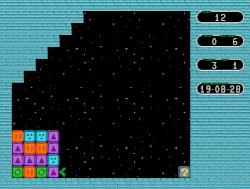

# Unblocked

A puzzle game inspired by NES game "Flipull" with a bit different mechanics.



As of version 1.0, it contains 56 puzzles (and one demo level that is unplayable).

For detailed information about hot keys, built-in help and replays, please see [documentation](docs.md).

## Installation

Before compiling the application from sources you may need to install extra developer libraries beforehand. Building it on Ubuntu 18 required to install the following libraries(ALSA, SDL2, and pkg-config):

```shell
$ sudo apt-get install libsdl2-dev libasound2-dev pkg-config
```

The application can be compiled from source, or installed using cargo:

```shell
$ cargo install unblock-it
```

You need Rust compiler that supports Rust 2018 edition (Rust 1.36 or newer) to do it. If you want to upgrade, execute the following command:

```shell
$ cargo install unblock-it --force
```

### Precompiled binaries

For Windows you can download precompiled binaries from [Release page](https://github.com/VladimirMarkelov/unblocked/releases).

Windows binary works on Windows 7 or newer Windows.

### Contact info

Suggestions, ideas, bugs, and better replays are very welcome. Send all of them to vmatroskin (at) gmail.com. Bugs can be submitted at [github](https://github.com/VladimirMarkelov/unblocked/issues)

## License

MIT
