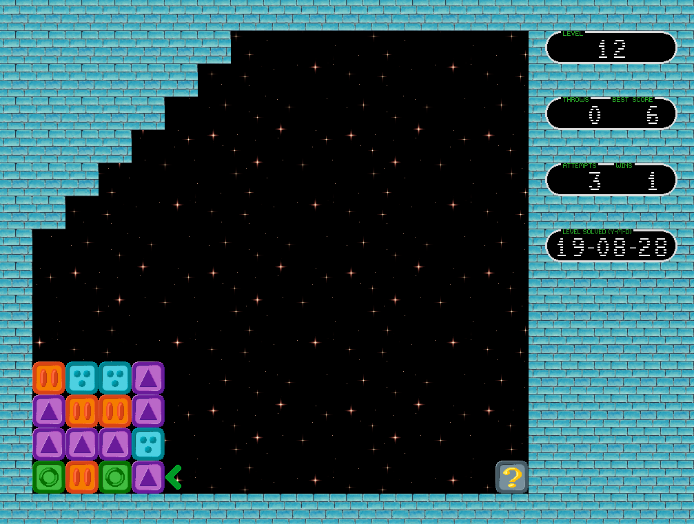

# Unblocked

A puzzle game inspired by NES game "Flipull" with a bit different mechanics.

As of version 1.0, it contains 56 puzzles (and one demo level that is unplayable).

# Table of Contents

- [Unblocked](#unblocked)
- [Table of Contents](#table-of-contents)
    - [Where the application stores its data files](#where-the-application-stores-its-data-files)
        - [Making the game portable](#making-the-game-portable)
        - [Running from a read-only location](#running-from-a-read-only-location)
    - [Game rules](#game-rules)
    - [Hotkeys](#hotkeys)
        - [Main menu](#main-menu)
        - [Demo mode](#demo-mode)
        - [While playing](#while-playing)
    - [Replays](#replays)
        - [How to use replays from release page](#how-to-use-replays-from-release-page)
        - [How to record a replay](#how-to-record-a-replay)
    - [FAQ](#faq)

## Where the application stores its data files

To play the game, you need only its binary. But the game may create files to track your progress. Please read below what files the games may create and how to turn the game to portable version.

The root game data directory depends on operation system and portability. In portable mode the data directory is the directory where the game's binary is. Otherwise, the root data directory is the current user's configuration directory:

* Linux:  `~/.config/rionnag/unblocked`
* Windows: `c:\Users\{username}\AppData\Roaming\rionnag\unblocked`
* OSX: `/Users/{username}/Library/Preferences/rionnag/unblocked`

After you win(or fail) the first level, the game creates `hiscores.toml` in its data directory to keep your progress.

If you save any of your replays, the game creates subdirectory `replays` in its root data directory, and saves the replay into it. The name of replay file is `level-<4 digits level number>.rpl`.

### Making the game portable

To make the game portable, create an empty file `config.toml` in the same directory where the game's binary is. Since next start, the game will save and read all its data from the binary's directory.

Note: Windows distribution is already portable. You have to delete `config.toml` to make the game using the current user's configuration directory.

### Running from a read-only location

The game is playable even if it is launched from read-only location(e.g. from CD). It will save its data to user's configuration directory.

You even can make it portable on CD by burn both the game binary and `config.toml` to the same directory. In this case the game does not save your progress and you have to start playing from the first level every game launch. So, it may be a good idea to complete the game before putting it to read-only location and add third file `hiscores.toml` to the game package. 

## Game rules

The game goal is to remove all blocks from the screen.

You can throw your block only if the first block it hits is a matching block. The block `?` is a "joker" block - it matches any block.

After the block is thrown, it annihilates all matching blocks and the first unmatched one becomes the new player's block.

## Hotkeys

### Main menu

* <kbd>up</kbd> and <kbd>down</kbd> - select menu item
* <kbd>left</kbd> and <kbd>right</kbd> - if the selected menu item is level number it decreases and increased the number
* <kbd>shift</kbd>+<kbd>left</kbd> and <kbd>shift</kbd>+<kbd>right</kbd> - if the selected menu item is level number it decreases and increased the number by 10
* <kbd>enter</kbd> or <kbd>space</kbd> - execute the selected menu item

### Demo mode

* <kbd>esc</kbd> - interrupt the replay and return to main menu or to the moment you stopped playing

### While playing

* <kbd>up</kbd> and <kbd>down</kbd> - move player's block up and down
* <kbd>space</kbd> - throw player's block if it is possible
* <kbd>esc</kbd> - exit to main menu (if you have made a few throws before pressing <kbd>esc</kbd>, the game counts the attempt failed)
* <kbd>f5</kbd> - save replay (if you have made no throws or failed, nothing is saved)
* <kbd>f1</kbd> - show saved replays (the hotkey works only if there is corresponding replay file for the level in `replays` directory)

## Replays

Distribution does not include any replays(except built-in one for the demo level). You have to copy them from somewhere, or download from game releases page.

### How to use replays from release page

1. Locate where the game stores its [data](#where-the-application-stores-its-data-files)
2. Create directory `replays` inside the data directory if it does not exist yet
3. Unpack all replays or one replay from the archive into `replays` directory
4. Start the game
5. Open the level you want to watch replay
6. Press <kbd>f1</kbd>, if everything has been done correctly the replay starts immediately

It is possible that a replay does not start even if everything has been done right. It is possible if the game and your replay are not compatible: every replay includes its version. In this case, it prints to stderr message `Unsupported version`. Solution: download replay pack of supported version from release page. At of version 1.0, there is the only one replay version. So, if you see `Unsupported version` it means that the replay file is damaged.

Another sign of invalid replay is player's brick is moving chaotically without making throws and taking a long pauses. It may mean that the replay file is for different level or invalid.

Note: replay format does not change if the game version changes. You should not re-download a replay pack every time you update the game.

### How to record a replay

Every time you start or restart a level, the game starts recording a replay. But it does not save anything automatically. You have to press <kbd>f5</kbd> to save the recorded replay. Pressing the key saves the recording to a file only if there is anything to save. If you just started or you failed the level, the recording is reset. So, do not try to save a replay after the game shows `no moves` - it won\'t save anything.

Do not hurry while recording a replay. Take your time and do not worry. When the game saves the replay to a file, it squeezes the replay so the longest pause between two actions turns to 3 seconds.

Warning: saving a new replay for a level overwrites previous one in the game [replay directory](#how-to-use-replays-from-release-page). So, if you want to save a few different replays for the same level, copy replays manually to safe location.

## FAQ

**Q. Why does my hiscore color change?**

A. When I was testing all the levels I wrote down my best results. And now the game shows how well you have done: white color means your hiscore equals mine; blue color means you made more throws than I did; and green color means you have beaten my hiscore. My results are not optimal: when I was watching replay, at least for 3 of them, I notices that the result can be improved by one throw.

**Q. And I spotted that the date when the level was solved successfully for the first time changes its color as well. Why?**

A. Yes, this date can be displayed in two different colors: white does not mean anything special, but blue color means that someone was cheating :) - the game detected that the level replay had been watched before the level was solved for the first time.
